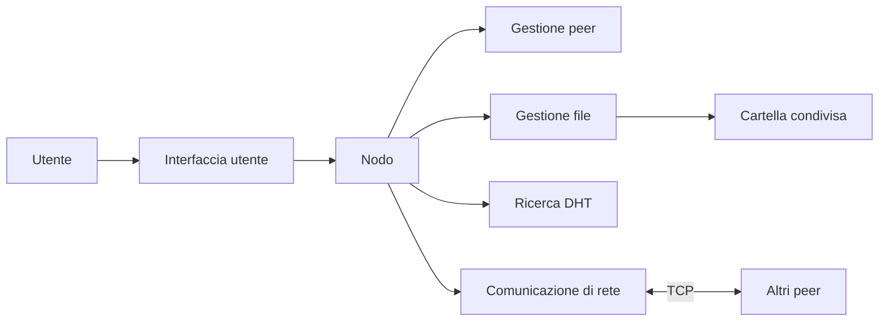
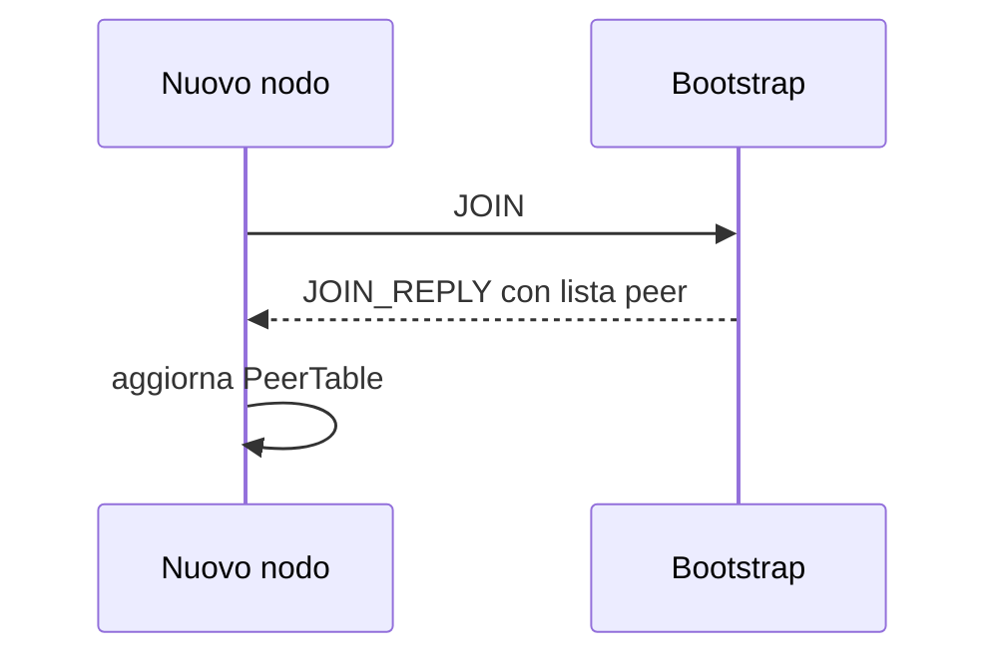
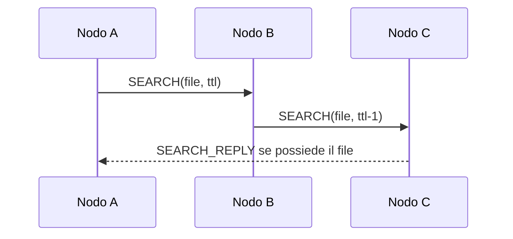
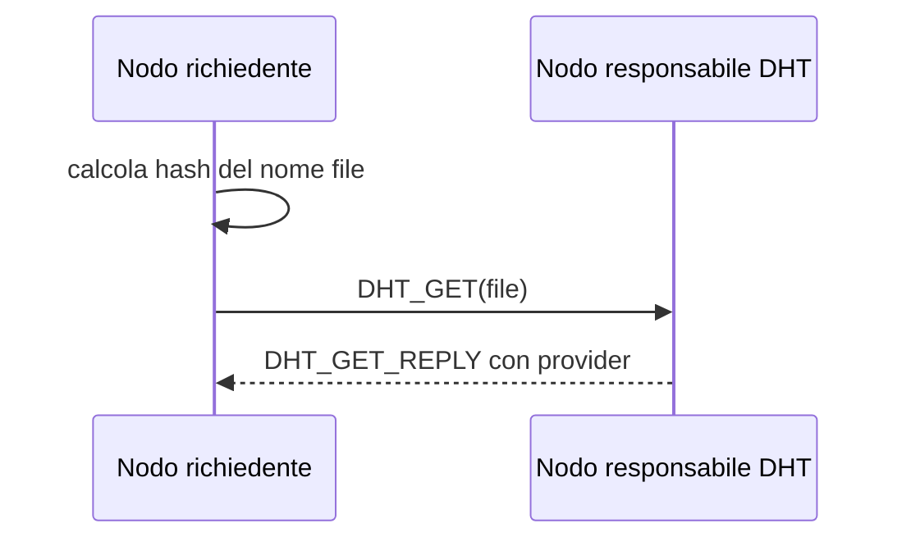
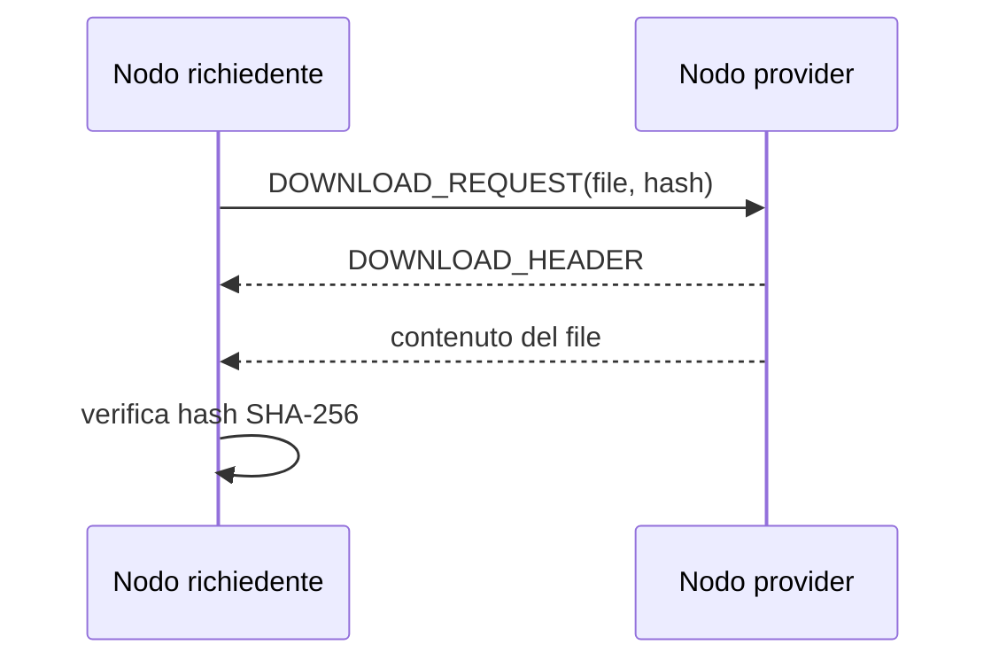

# Documentazione progetto - P2P File Sharing

## 1. Descrizione generale

Il progetto realizza una semplice rete peer-to-peer per la condivisione di file.
Ogni nodo e' un programma Python indipendente che puo':

- condividere i file presenti in una cartella locale;
- collegarsi ad altri nodi della rete;
- cercare file disponibili presso altri peer;
- scaricare un file trovato;
- usare una ricerca classica tramite flooding oppure una ricerca tramite DHT semplificata.

Non esiste un server centrale fisso. Ogni nodo è sia client, che server.

## 2. Requisiti funzionali

### 2.1 Avvio di un nodo

Un nodo viene avviato indicando almeno:

- la porta su cui ascoltare;
- la cartella condivisa;
- opzionalmente un nodo bootstrap a cui collegarsi.

Se non viene indicato un bootstrap, il nodo parte non conoscendo nessun "vicino", potrebbe essere il primo nodo, o in futuro aggiungere altri nodi della rete.

### 2.2 Join della rete

Un nuovo nodo puo' entrare nella rete contattando un nodo gia' attivo.
Il nodo bootstrap risponde con la lista dei peer che conosce.
Il nuovo nodo aggiorna quindi la propria tabella dei peer.

### 2.3 Gestione dei peer

Ogni nodo deve mantenere una lista dei peer conosciuti e le informazioni necessarie per contattarli e verificarne la disponibilita'.

### 2.4 Condivisione dei file

Il nodo deve rendere disponibili i file presenti nella propria cartella condivisa e verificare che un download sia corretto.

### 2.5 Ricerca tramite flooding

Il nodo deve consentire la ricerca di un file inoltrando una richiesta ai peer conosciuti, senza che il messaggio possa circolare all'infinito.
Se un peer possiede il file richiesto, deve rispondere direttamente al nodo che ha iniziato la ricerca.

### 2.6 Ricerca tramite DHT

Il nodo deve consentire la ricerca di un file tramite una Distributed Hash Table (DHT), individuando il peer responsabile della chiave associata al nome richiesto e richiedendogli quali nodi possiedono il file.

### 2.7 Download

Dopo una ricerca, l'utente deve poter scegliere un risultato e scaricare il file direttamente dal peer che lo possiede, verificandone l'integrita'.

## 3. Architettura

Il sistema e' composto dai seguenti componenti logici:

- interfaccia utente per l'avvio e l'uso del nodo;
- coordinamento delle funzionalita' del nodo;
- comunicazione di rete tra peer;
- protocollo dei messaggi;
- gestione dei peer conosciuti;
- gestione dei file condivisi e dei download;
- gestione della ricerca tramite DHT.

### 3.1 Diagramma architetturale



Il componente centrale e' il nodo.
Esso coordina la gestione dei file, dei peer, della DHT e della comunicazione di rete.

## 4. Dettagli implementativi

### 4.1 Interfaccia a riga di comando

Un nodo puo' essere avviato, ad esempio, con:

```bash
python main.py --port 8002 --shared shared_2 --bootstrap 127.0.0.1:8001
```

I comandi principali sono:

```text
help                      mostra i comandi
status                    mostra lo stato del nodo
peers                     mostra i peer conosciuti
files                     mostra i file locali condivisi
ping <host> <port>        verifica se un peer risponde
join <host> <port>        entra nella rete tramite un peer
search <filename>         cerca un file con flooding
dht_search <filename>     cerca un file con DHT
dht_index                 mostra l'indice DHT locale
results                   mostra i risultati delle ricerche
download <id> <index>     scarica un file trovato
exit                      arresta il nodo
```

### 4.2 Moduli

I componenti architetturali sono realizzati nei seguenti moduli:

- `main.py`: gestisce la CLI e l'avvio del nodo;
- `node.py`: contiene la logica principale del nodo;
- `network_manager.py`: gestisce socket TCP, invio e ricezione dei messaggi;
- `protocol.py`: definisce i messaggi del protocollo;
- `peer_table.py`: gestisce la lista dei peer conosciuti;
- `file_manager.py`: gestisce file condivisi, hash e download;
- `dht_manager.py`: gestisce la DHT;
- `scripts/dht_network.py`: avvia una rete locale di test.

### 4.3 Dati e ricerca

Per ogni peer vengono salvati:

- identificativo del nodo;
- host;
- porta;
- informazioni di stato, come ultimo contatto e numero di fallimenti.

All'avvio il nodo scansiona la cartella condivisa.
Per ogni file salva:

- nome;
- percorso locale;
- dimensione;
- hash SHA-256.

L'hash viene usato per identificare il contenuto del file e per verificare che un download sia corretto.

La ricerca tramite flooding e' avviata con `search <filename>` e include un TTL, cioe' un limite al numero di inoltri, per evitare che il messaggio circoli all'infinito.

La DHT usa un algoritmo semplificato di Chord: il nome del file viene trasformato in una chiave tramite hash SHA-1. Ogni nodo costruisce l'anello Chord usando i peer che conosce localmente. In caso di una rete molto sparsa il codice potrebbe non funzionare; in questo caso e' comunque possibile utilizzare la ricerca tramite flooding.

La ricerca tramite DHT e' avviata con `dht_search <filename>`. Dopo una ricerca, i risultati sono salvati con un `request_id`; l'utente puo' scaricare un file usando `download <request_id> <index>`. Il nodo contatta direttamente il peer che possiede il file, riceve i byte del file e verifica l'hash SHA-256. I file scaricati vengono salvati in una cartella di download associata alla cartella condivisa.

## 5. Protocolli usati

### 5.1 Comunicazione tra nodi

I nodi comunicano tramite TCP.
Ogni messaggio applicativo e' un oggetto JSON preceduto da 4 byte che indicano la lunghezza del messaggio.

Formato generale:

```text
[4 byte lunghezza][messaggio JSON]
```

Ogni messaggio contiene:

```json
{
  "type": "TIPO",
  "sender_id": "node_8001",
  "sender_host": "127.0.0.1",
  "sender_port": 8001,
  "payload": {}
}
```

### 5.2 Messaggi principali

| Messaggio | Funzione |
| --- | --- |
| `JOIN` | richiesta di ingresso nella rete |
| `JOIN_REPLY` | risposta con lista dei peer |
| `PING` / `PONG` | controllo raggiungibilita' |
| `SEARCH` | ricerca flooding |
| `SEARCH_REPLY` | risposta a una ricerca |
| `DOWNLOAD_REQUEST` | richiesta di download |
| `DOWNLOAD_HEADER` | risposta iniziale al download |
| `DHT_PUT` | pubblicazione metadati nella DHT |
| `DHT_GET` | richiesta metadati alla DHT |
| `DHT_GET_REPLY` | risposta della DHT |
| `ERROR` | errore |

### 5.3 Join di un nodo



### 5.4 Ricerca flooding



### 5.5 Ricerca DHT



### 5.6 Download



## 6. Esecuzione di test

Per avviare una rete locale di test con piu' nodi:

```bash
python scripts/dht_network.py start
```

Per vedere lo stato:

```bash
python scripts/dht_network.py status
```

Per fermare la rete:

```bash
python scripts/dht_network.py stop
```

## 7. Conclusione

Il sistema permette di creare una piccola rete P2P locale, condividere file, cercarli con flooding o DHT e scaricarli direttamente dai peer.
La struttura del codice separa la logica del nodo, la rete, il protocollo, la gestione dei file e la DHT.
